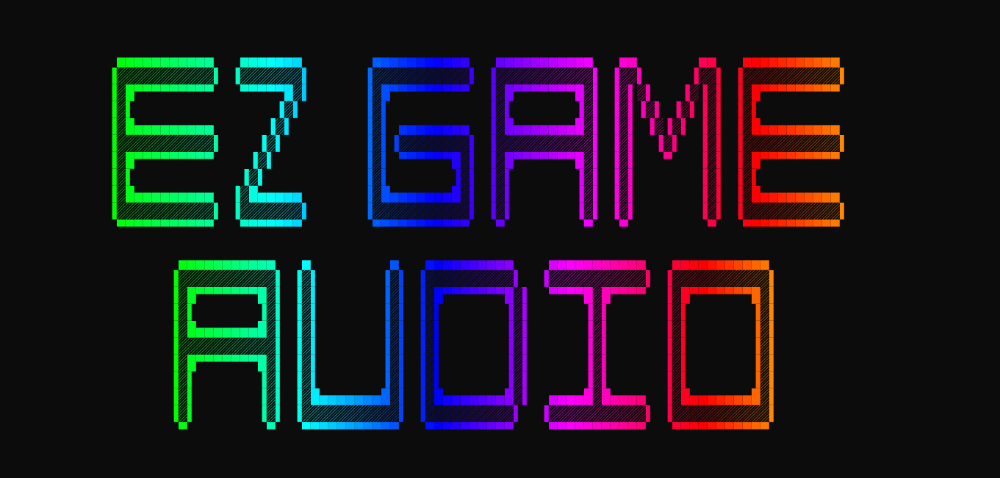

<!-- # <span style="color:red">EZ Game Audio Conversion </span> -->



<p align="center">
  
  
  
  
</p>

<p align="center">
  <a href="https://github.com/SpaceFoon/Ez-Game-Audio-Conversion/releases/">
    
  </a>
</p>

<!-- Pre-Headline -->
<p style="font-size: 16px; color: yellow; text-align: center;">Easiest, fastest and most reliable way to convert audio files available</p>


## Introduction

EZ-Game-Audio-Converter is a fast batch audio converter built for game developers and anyone managing large audio libraries. It focuses on doing the job with minimal setup and minimal friction: point it at your files, choose an output format, and let it run without babysitting.

## Features

- 💻 **User-Friendly Interface:** Designed with simplicity as the main goal.
- 🔄 **Unattended Batch Jobs:** Recursively scans folders and handles filename conflicts automatically with overwrite, rename, or skip behavior.
- 🚀 **Multi-threading:** Uses up to all available CPU cores.
- 🎵 **Automatic Bitrate and Codec Selection:** Chooses the output codec and a sensible variable bit rate target automatically, aiming for a strong balance between sound quality and file size.
- 🤖 **Smart File Handling:** Prevents the same output filename from being queued more than once.
- 📁 **Comprehensive Format Support:** Converts between WAV, MP3, OGG, FLAC, AIFF, and M4A AAC.
- 📝 **Metadata Support:** Preserves standard tags automatically, including title, artist, album, track and disc data, ReplayGain, many iTunes and podcast fields, and other safe metadata when supported by the target format.
- 🔁 **Loop Tag Support:** Reads loop points from supported input files and writes them to OGG, FLAC, MP3, and AIFF outputs. If the sample rate changes during conversion, loop timings are adjusted automatically. Loop points can be read from M4A and WAV, but cannot be written to those formats.
- 🎼 **Opus and Vorbis Support for OGG:** Supports both Ogg Opus for efficiency and Ogg Vorbis for compatibility.
- 🔒 **Fully Local Processing:** Runs entirely on your machine with no cloud uploads, no telemetry, no tracking, and no internet requirement.
- 🎶 **High-Quality Output:** Uses FFmpeg for conversion quality, codec support, and speed.


## Usage

1. **Setup:** Follow the setup prompts. It's recommended to copy and paste file paths. Right-click to paste.

2. **File Selection:** The application will search for matching files based on the provided criteria and display the list of input files to be converted.

3. **Duplicate Handling:** If multiple inputs would produce the same output path, only one output file is queued. Existing output-file conflicts are handled by the overwrite, rename, or skip options below.

4. **Conflict Resolution:** Resolve conflicts for conflicting output files:

   - `O`: Overwrite file with the same name. File will not overwrite itself but will skip instead.
   - `R`: Rename the file.
   - `S`: Skip the conversion for this file.
   - Adding `a` to your selection will apply it to all subsequent files.

5. **Confirmation:** Review the list of files to be converted and confirm by typing "yes" or "no" when prompted.

6. **Conversion:** Monitor progress and any errors during the conversion process. Upon completion, `logs.csv` will be available at the specified output path. Any errors will be logged separately to `error.csv`. Some files may produce errors but still convert correctly.

## Source

Prefer a hands-on approach over trusting random files from the internet? Here's how:

1. Clone the repository or download.

2. Install dependencies with `npm install`.

3. Choose the workflow you want:
   - `npm run dev` builds TypeScript and runs the app from `dist/`
   - `npm run build` compiles TypeScript to `dist/`
   - `npm run build:sea` builds the single executable application
   - `npm run package` builds the SEA release package, docs, checksums, and archives

4. Download FFmpeg and FFprobe for your platform and place them in `ffmpeg-bin/windows/`, `ffmpeg-bin/linux/`, or `ffmpeg-bin/macos/` before building packages.
   See [ffmpeg-bin/README.md](ffmpeg-bin/README.md) for download links and setup instructions.

To change codec or bitrate defaults, look in `src/converterWorker.ts`.

[On Github](https://github.com/SpaceFoon/Ez-Game-Audio-Conversion)


### Additional Notes

- M4A files are compressed using the 'AAC' lossy codec. For lossless quality, use WAV or FLAC formats.
- WAV and AIFF uses the pcm_s16le codec, while OGG uses the older and more compatible Vorbis codec by default.
- Lossy formats utilize Variable Bit Rate (VBR) for increased compression.
- Loop tags handling in this app:
  - **Read**: Can read loop points from any format (WAV, MP3, OGG, FLAC, AIFF, M4A)
  - **Write**: Can only write loop points to certain formats (OGG, FLAC, MP3, AIFF)
  - **Recommended**: For best loop point compatibility, use OGG or FLAC formats
- FLAC is minimaly compressed. Saves a lot of space while still being nearly lossless.

### Loop Point Support in This App

| Format | Can Read Loop Points | Can Write Loop Points | Notes                                         |
| ------ | -------------------- | --------------------- | --------------------------------------------- |
| OGG    | ✅ Yes               | ✅ Yes                | Best choice for loop points                   |
| FLAC   | ✅ Yes               | ✅ Yes                | Excellent lossless option                     |
| MP3    | ✅ Yes               | ✅ Yes                | Good compatibility                            |
| AIFF   | ✅ Yes               | ✅ Yes                | Limited player support                        |
| M4A    | ✅ Yes               | ❌ No                 | Loop points not supported in this application |
| WAV    | ✅ Yes               | ❌ No                 | Loop points not supported in this application |

For best results with loop points, use OGG or FLAC formats.

## Audio File Type Compatibility

### RPG Maker

| Features               | MP3 | OGG[^3] | WAV | M4A[^1] | MIDI    |
| ---------------------- | --- | ------- | --- | ------- | ------- |
| Loop OK                | NO  | YES     | YES | YES     | YES     |
| Loop Inside (Tags)[^4] | NO  | YES     | NO  | YES     | YES     |
| File Size Optimize     | YES | YES     | NO  | YES[^2] | OMG YES |
| Realistic Sound        | YES | YES     | YES | YES     | NO      |
| RMVX/Ace Compatible    | YES | YES     | YES | NO      | YES     |
| RMXP Compatible        | YES | YES     | YES | NO      | YES     |
| RM2003 Compatible      | YES | NO      | YES | NO      | YES     |
| RMMV Compatible        | NO  | YES     | NO  | YES     | NO      |
| RMMZ Compatible        | NO  | YES     | NO  | NO      | NO      |

[^1]: Not needed in 2024? Update: I don't care what they say, it's not needed.
[^2]: M4A can be lossless but isn't when converted by this software.
[^3]: Opus codec for OGG files is better but Vorbis is more compatible.
[^4]: As opposed to the basic looping of an audio file which simply replays the file, loop Tags are a way to tell the game engine where to start and end the loop. Example: A song or background sound effect may start at 0:00 and end at 1:00 but loop from 0:30 to 1:00. This avoids replaying intros in songs and makes seamless loops possible in music and sound effects.

- Source: [RPGMaker.net](https://rpgmaker.net/articles/2633/)

RPG Maker **MV and MZ will play Opus but do not support loop tags**. MV will not play Opus in the editor.

If you want Opus loop tags to work to work in RMMV-MZ then you will need my plugin.
[Download FugsOpusMV Here!](https://spacefoon.itch.io/fugs-ogg-opus-loop-tag-support-for-rmmv)

#### Unity

- **Supported Formats:** `MPEG(1/2/3), OGG Vorbis, .aiff, .mod, .it, .s3m, .xm`

Source: [Unity Documentation](https://docs.unity3d.com/352/Documentation/Manual/AudioFiles.html)

#### Godot

- **Supported Formats:** `WAV, MP3, OGG Vorbis`

Source: [Godot Documentation](https://docs.godotengine.org/en/stable/tutorials/assets_pipeline/importing_audio_samples.html#supported-audio-formats)

#### Unreal Engine

- **Supported Format:** `WAV`
- Unreal Engine currently imports uncompressed, little endian , 16-bit Wave (WAV) files at any sample rate (although, we recommend sample rates of 44.1 kHz or 22.05 kHz).
  Source: [Unreal Engine Documentation](https://docs.unrealengine.com/4.27/en-US/WorkingWithAudio/ImportingAudio/)

#### Ren'Py

- **Supported Formats:** `Ogg Opus, Ogg Vorbis, MP3, MP2, FLAC, AIFF WAV (uncompressed 16-bit signed PCM only)`

Source: [Ren'Py Documentation](https://www.renpy.org/doc/html/audio.html)

#### Game Maker Studio

- **Supported Formats:** `OGG Vorbis, MP3 and WAV`
  Source: [Gamemaker.io](https://manual.gamemaker.io/monthly/en/GameMaker_Language/GML_Reference/Asset_Management/Audio/Audio.htm)

#### Additional Comparison

[Detailed comparison of audio formats for games](https://dev.to/tenry/comparison-of-audio-formats-for-games-jak).

[Opus bit rate and sample info](https://wiki.xiph.org/Opus_Recommended_Settings)

[Some testing on performance](https://stsaz.github.io/fmedia/audio-formats/)

[Comparison of coding efficiency between Opus and other popular audio formats](<https://en.wikipedia.org/wiki/Opus_(audio_format)#Quality_comparison_and_low-latency_performance>)

## **Find me on the web:**

**Your comments and likes are appreciated for support!**

[Itch.io](https://spacefoon.itch.io/ez-game-audio-format-conversion)
[Source on GitHub](https://github.com/SpaceFoon/Ez-Game-Audio-Conversion)
[RPG Maker Forums](https://forums.rpgmakerweb.com/index.php?threads/v1-3-tool-ez-batch-game-audio-converter-for-windows.163150/)
[Download mirror: ascensiongamedev.com](https://www.ascensiongamedev.com/files/file/183-ez-game-audio-conversion/)

## License

[Licence](/LICENSE)


If you would like to use this software for commercial purposes, please contact me on [Itch.io](https://spacefoon.itch.io/ez-game-audio-format-conversion) 
### Attribution

- [Icon Source](https://icon-icons.com/icon/audio-x-generic/36263)
- [Guy on forum who helped me a lot](https://forums.rpgmakerweb.com/index.php?members/att_turan.41930/)


## Installation

1. **Download** [Latest Release](https://github.com/SpaceFoon/Ez-Game-Audio-Conversion/releases)
2. **Choose** the archive for your platform:
  - Windows: `EZ-Game-Audio-Windows.zip` or `.7z`
  - Linux: `EZ-Game-Audio-Linux.zip` (You build)
  - macOS: `EZ-Game-Audio-macOS.zip` (You build)
3. **Extract** the archive
4. **Run** the packaged executable:
  - Windows: `EZ-Game-Audio.exe`
  - Linux/macOS: `EZ-Game-Audio`

## Checksums (SHA-256)

Release archives include a matching `.sha256` file for integrity verification. You can verify the download before running it.
Replace `<archive-name>.zip` with the actual archive you downloaded.

**Windows (PowerShell):**
Get-FileHash .\<archive-name>.zip -Algorithm SHA256

**macOS/Linux:**
shasum -a 256 <archive-name>.zip

Compare the output hash to the contents of the `.sha256` file.

## Prerequisites

- Building from source: Windows, Linux, and macOS are supported
- Node.js 24
- FFmpeg and FFprobe binaries for target OS at `ffmpeg-bin/<platform>/`
- Optional on Windows: Windows Terminal from the Windows Store for enhanced visual experience (emoji support 😎 ).

### Testing

All tests are organized in the `src/__tests__/` directory with the following structure:

```
src/__tests__/
├── integration/                  # Integration tests
├── test-utils/                   # Reusable test utilities
├── test-assets/                  # Location for test assets
└── unit tests                    # Various .test.js files
```

To run tests:

- `npm test` - Run all Jest tests
- `npm run test:ci` - Run tests with open handle detection (CI-safe)
- `npm run test:coverage` - Run tests with coverage report
- `npm run smoke` - Build/package and run the smoke test

CI runs the same checks in the workflow at [.github/workflows/ci.yml](.github/workflows/ci.yml).
Release steps are documented in [.github/workflows/RELEASE-GUIDE.md](.github/workflows/RELEASE-GUIDE.md).
