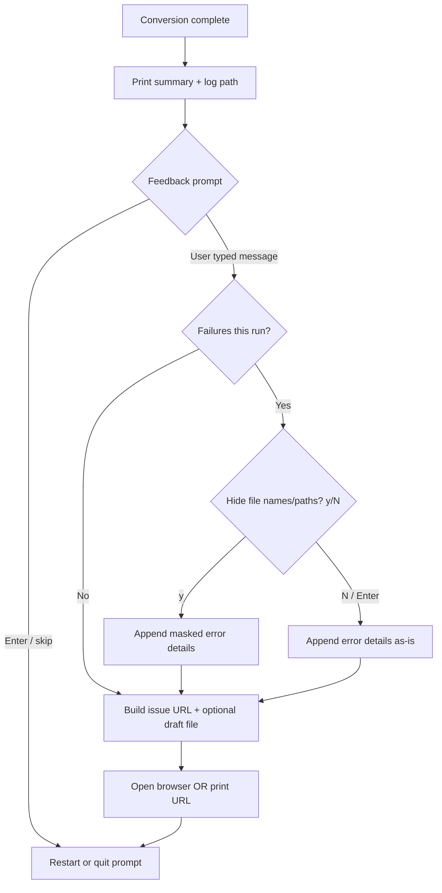

# Post-conversion feedback (design draft)

**Status:** Idea / not implemented  
**Motivation:** High download volume, almost no user reports. Automated tests cover logic; this feature would make *voluntary* human signal easier when something feels wrong (or went well).

Related: [GitHub issue templates](../.github/ISSUE_TEMPLATE/), [finalize.ts](../src/finalize.ts) (natural hook after conversion summary).

---

## Problem

- Downloads across itch, GitHub, and mirrors outnumber comments by a large margin.
- Users typically run a batch, get results, and close the app — especially when things work.
- Bugs on rare paths (duplicate output collision, worker edge cases) may never surface in issues.
- Manual QA from the maintainer cannot scale with silent adoption.

This is **not** a replacement for tests. It is a low-friction way for the small fraction of users who *would* speak up to do so with useful context.

---

## Goals

- Optional, skippable prompt after a conversion job completes.
- User types a short message in the terminal.
- Help them open a **pre-filled GitHub issue** in the browser — they review and submit manually.
- Auto-attach structured run metadata (version, OS, counts, log path) so reports are actionable.
- **Errors included automatically:** if the run had failures, the report carries the error details — no separate "include errors?" question. Giving feedback on a failed run *is* the consent; the browser review is the safety net.
- **Opt-in privacy masking:** one y/N question asks whether to hide file names and paths in the report (default No = real names shown). Masking applies everywhere: issue body, draft file, and the share-ready error CSV copy.
- Preserve the product promise: **fully local, no telemetry, nothing sent without explicit user action in the browser.**

## Non-goals

- Automatic submission to GitHub (no embedded tokens, no background POST).
- Requiring a GitHub account to use the converter.
- Blocking restart/quit flow unless the user opts in.
- Collecting analytics, crash dumps, or file uploads from the app.

---

## Recommended approach

### Flow

Insert an optional step in `finalize.ts` **after** the conversion summary and `reportSearchErrors()`, **before** the existing “Press ENTER to run another conversion / q to quit” prompt.



### User-facing copy (draft)

```
Feedback? Type a message and press ENTER, or press ENTER to skip.
Nothing is sent automatically — your browser will open GitHub so you can review and submit.
```

If the run had failures and the user typed a message, error details are included
automatically. The only question is a privacy one:

```
3 errors will be included in the report.
Hide file names and folder paths? [y/N]
You can review everything in the browser before submitting.
```

If browser open fails (headless CI, no default browser):

```
Could not open a browser. Copy this link or find feedback-draft.txt in your log folder:
https://github.com/SpaceFoon/Ez-Game-Audio-Conversion/issues/new?...
```

### GitHub issue URL

Use the [GitHub “new issue” URL](https://docs.github.com/en/issues/tracking-your-work-with-issues/using-issues/creating-an-issue) with query parameters:

```
https://github.com/SpaceFoon/Ez-Game-Audio-Conversion/issues/new
  ?template=bug_report.md
  &title=<encoded title>
  &body=<encoded body>
```

- **`template`:** `bug_report.md` for failures; consider a separate `feedback.md` template for general praise/suggestions (optional follow-up).
- **`title`:** e.g. `Feedback v1.8.0 (win32)` or `Bug report v1.8.0 — 3 failures`.
- **`body`:** Structured block (see below) + user message.

**URL length:** Browsers and GitHub impose practical limits (~8k characters). Keep the auto-generated body concise; truncate an very long user message with “… (truncated)” if needed.

### Auto-included metadata (issue body)

| Field | Source |
|-------|--------|
| App version | `package.json` at build time or runtime read (dev); SEA builds should use the packaged version |
| OS / arch | `globalThis.env.platform`, `globalThis.env.arch` |
| Runtime | SEA vs `npm run dev` (`isSeaRuntime` / `isPackagedRuntime` from `utils.ts`) |
| Input formats | `settings.inputFormats` |
| Output formats | `settings.outputFormats` |
| OGG codec | `settings.oggCodec` if applicable |
| Job stats | success count, failure count, duration (already in `finalize`) |
| Log folder | `settings.outputFilePath` |
| User message | Raw terminal input |

Example body:

```markdown
## User feedback

<paste user message>

---

## Run info (auto-filled)

| | |
|---|---|
| Version | 1.8.0 |
| OS | win32 x64 |
| Runtime | SEA |
| Input formats | wav, ogg |
| Output formats | ogg (opus) |
| Results | 847 ok, 3 failed |
| Duration | 124.5 s |
| Logs | D:\game\audio\converted\ |

If something failed, please attach `logs.csv` and `error.csv` from the log folder.
```

### Error details (automatic) + opt-in masking

Errors are **already saved locally** to `error.csv` regardless of this feature — that never
changes. This section covers what gets embedded in the pre-filled issue.

**Consent model:**

- Choosing to give feedback after a failed run **is** the consent to include error details —
  no separate "include errors?" question. Users reporting a failure want the errors attached;
  asking again is friction that produces useless reports.
- The one question asked is **privacy masking**, opt-in, default No:
  `Hide file names and folder paths? [y/N]`. Masking replaces paths/names with stable
  placeholders (`file-1.wav`, `file-2.flac` — extension kept, since format matters for
  debugging) in the issue body, the draft file, and the share-ready CSV copy.
- Final safety net: the user reviews the complete body in the browser before submitting.

**Data source:** the in-memory `failedFiles: ConversionResult[]` that `finalize()` already
receives (`inputFile`, `outputFile`, `error`) — no need to re-read/parse `error.csv`.

**Masking rules (when opted in):**

- Input/output paths → `file-N.<ext>` placeholders, consistent within the report
  (same file always maps to the same placeholder).
- ffmpeg error text: strip anything that looks like an absolute path from stderr
  (ffmpeg echoes full paths mid-message), keep the error reason.
- When masking is off, paths are included as-is — the browser review is the safeguard.

**Truncation (URL budget):** embed the first **10 failures** + a
`… and N more (see attached error.csv)` line, keeping the total body under the ~8k URL limit.

**"Sending" the full error.csv:** a URL cannot attach files, so the app writes a
share-ready copy `error-report.csv` next to the logs (masked if masking was chosen —
never hand users a "safe" report while the file they're told to attach still leaks paths)
and the pre-filled body says: *"Please drag `error-report.csv` from your log folder into
this issue."* Attaching stays a manual, visible act in the browser, consistent with the
privacy promise.

Example block appended to the body (masked variant shown):

```markdown
## Errors (auto-included — file names hidden at user's request)

| File | Error |
|---|---|
| file-1.wav → file-1.ogg | ffmpeg exit 1: Invalid data found when processing input |
| file-2.flac → file-2.ogg | ffmpeg exit 1: Error while decoding stream #0:0 |
| file-3.mp3 → file-3.ogg | output file busy (EBUSY) |

Full log: please drag `error-report.csv` from your log folder into this issue.
```

### Local draft file (fallback)

When the user submits feedback text, also write:

```
<outputFilePath>/feedback-draft.txt
```

Same content as the issue body plus the full URL on the last line. Users without GitHub, or offline users, can paste later (itch, forum, email).

---

## What not to do

| Approach | Why avoid |
|----------|-----------|
| GitHub REST API + repo token in the exe | Spam, abuse, token revocation, security |
| Ask users for a Personal Access Token | Unacceptable friction |
| Silent network calls | Breaks “fully local” trust |
| Mandatory feedback step | Blocks unattended batches and annoys power users |

---

## Prompt timing (options)

Pick one at implementation time; default recommendation is **B**.

| Mode | Behavior |
|------|----------|
| **A. Always ask** | Maximum visibility; may annoy repeat users |
| **B. Only on failures or search errors** | Higher signal, lower noise *(recommended)* |
| **C. Only when `failCount > 0`** | Strictest; misses “wrong metadata but exit 0” reports |
| **D. Env flag `EZGA_FEEDBACK=1`** | Power-user override for always-on in CI/debug |

Also skip the prompt when stdin is not a TTY (piped/automation), same pattern as other interactive prompts.

---

## Implementation sketch

### New module (suggested)

`src/feedbackPrompt.ts` — keeps `finalize.ts` thin:

- `promptOptionalFeedback(): Promise<string | null>`
- `promptMaskPaths(failCount: number): Promise<boolean>` — only called when `failCount > 0`; default No (paths shown)
- `buildErrorExcerpt(failedFiles: ConversionResult[], mask: boolean): string` — max 10 rows; placeholders when masked
- `writeErrorReportCsv(outputDir: string, failedFiles: ConversionResult[], mask: boolean): void` — share-ready `error-report.csv`
- `buildFeedbackIssueUrl(message: string, context: FeedbackContext, errorExcerpt?: string): string`
- `writeFeedbackDraft(outputDir: string, content: string): void`
- `openBrowser(url: string): void` — `start` (Windows), `open` (macOS), `xdg-open` (Linux); no new npm dependency

### `finalize.ts` change

After line ~61 (`Log files are in: …`), call feedback helper when enabled, then existing `promptToContinue()`.

### Version helper

Add `getAppVersion()` in `utils.ts` (read root `package.json` relative to runtime base dir) so SEA and dev both report correctly.

### Optional: new issue template

`.github/ISSUE_TEMPLATE/feedback.md` — shorter than bug report, for non-bug comments (“faster than X”, feature ideas). URL uses `template=feedback.md` when `failCount === 0`.

---

## Testing

| Test | Type |
|------|------|
| URL encoding (spaces, `#`, newlines, unicode) | Unit |
| Body includes version, counts, paths | Unit |
| Skip on empty input | Unit |
| Skip when `!process.stdin.isTTY` | Unit |
| Browser open invoked with encoded URL (mock `spawn`) | Unit |
| Errors auto-included when `failCount > 0` and message given | Unit |
| Mask prompt skipped when `failCount === 0` | Unit |
| Mask prompt defaults to No (empty input keeps real paths) | Unit |
| Masking: paths → stable `file-N.<ext>` placeholders (same file, same placeholder; Windows + POSIX separators) | Unit |
| Masking: absolute paths stripped from ffmpeg stderr text | Unit |
| Masking applied consistently to body, draft file, and `error-report.csv` | Unit |
| Error excerpt truncates at 10 failures with "and N more" line | Unit |
| `error-report.csv` written next to logs (masked and unmasked variants) | Unit |
| Body stays under URL length budget with max-size excerpt | Unit |
| Draft file written next to output path | Unit |
| `finalize` integration: feedback prompt before restart prompt | Unit (mock `rl`) |

Do **not** open a real browser or create real GitHub issues in CI.

---

## Privacy & README note

When shipped, add one line to README under features or usage:

> Optional post-run feedback opens a pre-filled GitHub issue in your browser. Nothing is transmitted unless you submit it on GitHub.

---

## Success metrics (expectations)

- Conversion rate from “runs” to “issues filed” will stay **low** (often &lt;1–2%). That is normal.
- Value is in **quality per report** (version + log path + counts), not volume.
- Compare issue rate before/after across 2–3 releases if curious; no in-app analytics required.

---

## Open questions

1. Separate templates for bug vs general feedback?
2. Ask only on failures (recommended) or always with easy skip?
3. Show feedback prompt on **every** batch in a restart loop, or once per process launch?
4. Include a link to itch as alternative contact for users without GitHub?

---

## Implementation checklist

- [ ] `getAppVersion()` helper
- [ ] `src/feedbackPrompt.ts`
- [ ] Error excerpt builder (auto-included on failures) + mask y/N prompt (default No)
- [ ] `error-report.csv` writer (masked/unmasked)
- [ ] Hook in `finalize.ts` (TTY + timing guard; pass `failedFiles` through)
- [ ] Optional `.github/ISSUE_TEMPLATE/feedback.md`
- [ ] Unit tests
- [ ] README one-liner
- [ ] Manual smoke: Windows SEA, browser opens, issue form pre-filled
