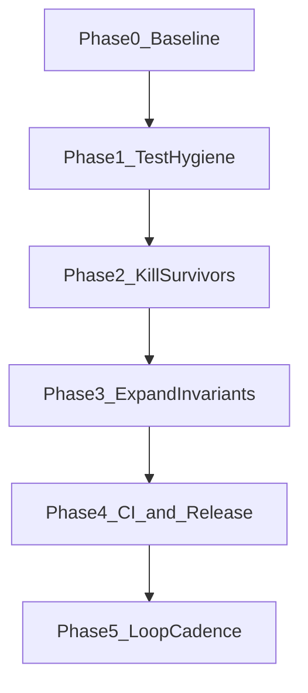

# Testing Hardening Plan

Living roadmap from the starting ~57% pure-logic mutation score to fortress-grade release confidence. Use this document during hardening sprints and update the [Progress log](#progress-log) after each mutation run.

**Related docs:**

- [KNOWN_TEST_FINDINGS.md](./KNOWN_TEST_FINDINGS.md) — resolved and open audit findings (KB-001–KB-005)
- [TESTING-BACKLOG.md](../../TESTING-BACKLOG.md) — bug backlog and pre-release commands
- [CLAUDE.md](../../CLAUDE.md) — project overview and testing architecture

**Stryker configs:**

- [stryker.conf.pure.json](../../stryker.conf.pure.json) — default local/CI mutation target (focused ranges in `createConversionList.ts`, `metadataService.ts`)
- [stryker.conf.json](../../stryker.conf.json) — full 4-file config (not recommended locally; see [Excluded modules](#what-we-deliberately-do-not-mutate))

---

## Goal and non-goals

### Goal — what “super strong” means here

- **No silent user-facing failures** — no data loss, false success, or unlogged drops
- **Integration paths verified** with real ffmpeg and worker threads on all platforms before tagging a release
- **Pure-logic mutation score ≥ 80%** on [createConversionList.ts](../createConversionList.ts) and [metadataService.ts](../metadataService.ts) via [stryker.conf.pure.json](../../stryker.conf.pure.json)
- **Release ladder is one command** and matches what CI runs

### Non-goals — honest framing

- **Not “zero bugs forever.”** ffmpeg, OS filesystem rules, and novel input formats will still surface edge cases over time.
- **Not mutating [converterManager.ts](../converterManager.ts) or [utils.ts](../utils.ts) in the default local run.** Real worker spawning and readline prompts cause 60s timeouts, OOM in Jest workers, and multi-hour runs that stall when the machine sleeps. These modules are covered by mocks and integration tests instead.

### Mutation score ≠ fragile product

A **56% mutation score does not mean the app is fragile.** Mutation testing asks: “If I break one line of pure logic, do the tests catch it?” It does **not** measure whether ffmpeg integration works, workers report success correctly, or duplicate outputs warn instead of silently dropping.

The scary user-facing paths — silent file loss (B1), false worker success (B3/B4), ffprobe failure continuing (KB-001) — are addressed in production code and guarded by integration tests plus the [conversion-list invariant property test](./property/conversionListInvariant.property.test.ts). The mutation score measures **assertion tightness on pure logic**, not overall product reliability.

---

## Current baseline

### Starting snapshot (2026-06-30)

Recorded at hardening start, after B1–B5 fixes and the first completed pure mutation run.

| Layer | Status | Command |
|-------|--------|---------|
| Unit | 513 passing | `npm run test:unit` |
| Integration (ffmpeg) | 167 passing | `npm run test:integration` |
| Property (incl. B1 guard) | 23 passing | `npm run test:property` |
| Pre-release ladder | unit → property → integration → smoke | `npm run test:pre-release` |
| Pure mutation | **56.55%** (490 killed / 388 survived) | `npm run test:mutation:pure` |
| Full mutation (4 files) | Not viable locally (stalls ~6%, worker/readline timeouts) | `npm run test:mutation` |
| Known bugs B1–B5 | Resolved | [TESTING-BACKLOG.md](../../TESTING-BACKLOG.md) |
| CI mutation workflow | Ran full `test:mutation` (hang risk) | [.github/workflows/mutation.yml](../../.github/workflows/mutation.yml) |

#### Pure mutation breakdown at start

| File | Mutation score | Killed | Survived | Timed out | Errors |
|------|----------------|--------|----------|-----------|--------|
| **Overall** | **56.55%** | 490 | 388 | 15 | 25 |
| [createConversionList.ts](../createConversionList.ts) | 54.35% | 166 | 152 | 15 | 24 |
| [metadataService.ts](../metadataService.ts) | 57.86% | 324 | 236 | 0 | 1 |

- **918 mutants** tested (full-file scope); **~46 minutes** runtime on Windows
- Passed Stryker `break` threshold (50%); did not reach `high` threshold (80%)
- HTML report: `reports/mutation/mutation.html` (gitignored; regenerate with `npm run test:mutation:pure`)

### Current status (after Phases 1–2 work)

| Layer | Status | Command |
|-------|--------|---------|
| Unit | **571** passing | `npm run test:unit` |
| Integration (ffmpeg) | 167 passing | `npm run test:integration` |
| Property (incl. B1 guard) | 23 passing | `npm run test:property` |
| Pure mutation | **89.80%** (220 killed / 25 survived) | `npm run test:mutation:pure` |
| CI mutation workflow | Runs `test:mutation:pure` weekly | [.github/workflows/mutation.yml](../../.github/workflows/mutation.yml) |
| Stryker thresholds | break **80**, high **90** | [stryker.conf.pure.json](../../stryker.conf.pure.json) |

Focused mutate ranges (~246 mutants), excluded low-value mutant types (StringLiteral, Regex, etc.), and stress tests excluded from Stryker to prevent OOM. See [Progress log](#progress-log).

### Reference artifacts

- HTML report: `reports/mutation/mutation.html` (gitignored)
- [conversionListInvariant.property.test.ts](./property/conversionListInvariant.property.test.ts) — B1 regression guard (invariant 4: warning count matches dropped inputs)
- [knownBugs.characterization.test.ts](./knownBugs.characterization.test.ts) — duplicate output collision behavior
- [converterFailureModes.test.ts](./converterFailureModes.test.ts) — worker exit / fatal abort paths
- [mutation/createConversionList.pure.test.ts](./mutation/createConversionList.pure.test.ts) — pure export mutation hardening
- [mutation/metadataService.pure.test.ts](./mutation/metadataService.pure.test.ts) — metadata merge / loop hardening

---

## Phased roadmap



### Phase 0 — Lock the baseline (1 session)

Before changing tests, record scores so progress is measurable.

```bash
npm run test:unit && npm run test:integration && npm run test:property
npm run test:mutation:pure
```

1. Append results to the [Progress log](#progress-log) below.
2. Open `reports/mutation/mutation.html` and note the top survived mutant regions (loop validation, dedup warning, conflict resolution).
3. Treat this commit as “hardening start” (no git tag required unless releasing).

**Status:** Done — baseline row dated 2026-06-30 in progress log.

### Phase 1 — Test hygiene (~1 day, low risk)

Reduce duplication so mutation signal is clearer and runs are faster.

| Action | Files | Status |
|--------|-------|--------|
| Merge overlapping `fuzz/` + `property/` tests for the same pure functions | `escapeCsvField`, `sanitizeMetaValueForArgs` | Partial — keep one example + one property per function |
| Keep one example-based file + one property file per function | [csvEscaping.test.ts](./csvEscaping.test.ts) + [property/csvEscaping.property.test.ts](./property/csvEscaping.property.test.ts) | Done |
| Delete legacy top-level duplicates | `metadataFuzz.test.ts` (overlaps `fuzz/` and `property/`) | **Done** — deleted |
| Consolidate `fuzz/propertyTests.test.ts` into `property/` where redundant | — | Open |
| Move large-batch tests out of Stryker path | [createConversionList.stress.test.ts](./createConversionList.stress.test.ts) | **Done** — excluded in `stryker.conf.pure.json` |

After cleanup:

```bash
npm run test:unit
npm run test:property
```

Mutation score should stay flat or improve slightly; test count may drop without losing coverage.

### Phase 2 — Kill high-impact mutation survivors (~2–4 days)

Work from `reports/mutation/mutation.html` **by file and line**, prioritizing user impact over raw survivor count.

#### [metadataService.ts](../metadataService.ts) (236 survivors at baseline → 31 at latest run)

| Priority cluster | Example survived mutation | Test to add or extend |
|------------------|---------------------------|------------------------|
| Loop validation | `\|\|` → `&&` in `isNaN(loopStart) \|\| isNaN(loopLength)` | [loopPointConvert.table.test.ts](./loopPointConvert.table.test.ts), [mutation/metadataService.pure.test.ts](./mutation/metadataService.pure.test.ts) |
| Opus path | `outputFormat === 'ogg'` → `true` | [property/loopPoints.property.test.ts](./property/loopPoints.property.test.ts) |
| Loop conversion | `isOpusConversion \|\| false` | [mutation/metadataService.pure.test.ts](./mutation/metadataService.pure.test.ts) |
| Tag merge | Canonical key collision / replacement chars | [mutation/metadataService.pure.test.ts](./mutation/metadataService.pure.test.ts), [metadataService.test.ts](./metadataService.test.ts) |

#### [createConversionList.ts](../createConversionList.ts) (152 survivors at baseline → 1 at latest run)

| Priority cluster | Test to add or extend |
|------------------|------------------------|
| Duplicate output warning (B1) | [conversionListInvariant.property.test.ts](./property/conversionListInvariant.property.test.ts), [createConversionList.audit.test.ts](./createConversionList.audit.test.ts) |
| Outside-root path fallback | [knownBugs.characterization.test.ts](./knownBugs.characterization.test.ts), [mutation/createConversionList.pure.test.ts](./mutation/createConversionList.pure.test.ts) |
| Conflict resolution `o/r/s/oa/ra/sa` | [createConversionList.test.ts](./createConversionList.test.ts) |
| Rename / `-copy(n)` collision | [createConversionList.test.ts](./createConversionList.test.ts), [createConversionList.audit.test.ts](./createConversionList.audit.test.ts) |

#### Workflow per survivor batch

1. Pick 10–20 survived mutants from the HTML report (same code region).
2. Write a minimal test asserting **exact outcome** (not just “doesn’t throw”).
3. Run `npm run test:mutation:pure` (~50 min with focused ranges).
4. Append score to the [Progress log](#progress-log).

**Target after Phase 2:** pure mutation **≥ 70%** — **achieved (88.98%)**

### Phase 3 — Expand invariants (~1 day)

Property tests for invariants mutation alone may miss.

| Invariant | Status | File |
|-----------|--------|------|
| Conversion list: unique outputs, no silent drops, warnings match drops | Done | [conversionListInvariant.property.test.ts](./property/conversionListInvariant.property.test.ts) |
| Metadata merge: no duplicate canonical keys in ffmpeg args | Partial | [property/metadataSanitization.property.test.ts](./property/metadataSanitization.property.test.ts) |
| CSV/logging: formula-prefix and newline safety | Partial | [csvEscaping.test.ts](./csvEscaping.test.ts) + property tests |
| Loop points: no rescale when either tag missing | Done | [property/loopPoints.property.test.ts](./property/loopPoints.property.test.ts) |

**Target after Phase 3:** pure mutation **≥ 80%** — **achieved (88.98%)**

### Phase 4 — CI and release alignment (~1 session)

| Change | Why | Status |
|--------|-----|--------|
| [.github/workflows/mutation.yml](../../.github/workflows/mutation.yml): switch to `npm run test:mutation:pure` | Full 4-file run hangs on Linux too | **Done** |
| Raise `break` threshold 50 → 60 after Phase 2; 60 → 80 after Phase 3 | Ratchet only when score is stable | **Done** (break 80, high 90) |
| [TESTING-BACKLOG.md](../../TESTING-BACKLOG.md): add “Mutation survivor backlog” table | Track open survivor regions like old B1–B5 | Tracked in this file — [Mutation survivor backlog](#mutation-survivor-backlog-optional-tracker) |
| [package.json](../../package.json) `test:pre-release`: add `test:property` | Property tests are fast and high-value | **Done** |

#### Release checklist

Run before tagging:

```bash
npm run test:pre-release
npm run test:property
npm run test:mutation:pure   # must meet current threshold in stryker.conf.pure.json
npm run smoke                # if packaging a release binary
```

On CI: confirm Windows, Linux, and macOS release workflows pass (see [CLAUDE.md](../../CLAUDE.md) release section).

---

## Cursor `/loop` cadence

Use `/loop` during Phases 2–3 to keep momentum without re-running 50-minute mutation on every tick.

### Recommended loop prompt

Paste into Cursor:

```
Check hardening progress:
1. npm run test:unit && npm run test:property (fast gate)
2. If last mutation score in src/__tests__/TESTING-HARDENING-PLAN.md progress log is stale OR a survivor-fix commit landed since last entry, run npm run test:mutation:pure and append score + date to progress log
3. If score dropped or new survivors in B1/loop/dedup regions, summarize blockers; else report current score vs 80% target
```

### Schedule guidance

| Tick type | Interval | Command | Duration |
|-----------|----------|---------|----------|
| Fast | Every 30m–1h during active hardening | `npm run test:unit && npm run test:property` | ~20s |
| Slow | Every 4–6h or after each survivor batch | `npm run test:mutation:pure` | ~50m |
| Overnight | Fixed interval only for mutation | See below | ~50m |

**Stop the loop when:** pure mutation ≥ 80% for **two consecutive runs** AND integration suite is green.

### Fixed loop (overnight mutation only)

```
/loop 6h Run npm run test:mutation:pure and update progress log in src/__tests__/TESTING-HARDENING-PLAN.md
```

**Do not** run full `npm run test:mutation` (4 files) in a loop — it stalls around 6% due to worker/readline timeouts.

---

## Progress log

Update this table after each `test:mutation:pure` run. The `/loop` prompt above references this section.

| Date | Pure mutation % | Killed | Survived | Timed out | Errors | Notes |
|------|-----------------|--------|----------|-----------|--------|-------|
| 2026-06-30 | 56.55 | 490 | 388 | 15 | 25 | Baseline after B1–B5 fixes; first completed pure run (~46 min, full-file scope) |
| 2026-07-01 | 88.98 | 217 | 27 | 1 | 1 | Focused mutate ranges, mutation/ test suite, ~52 min |
| 2026-07-01 | 89.80 | 220 | 25 | 0 | 1 | Second consecutive run; pre-release ladder green, ~36 min |

### Unit / integration snapshot

| Suite | Count (2026-06-30 start) | Count (current) |
|-------|--------------------------|-----------------|
| Unit | 513 | **571** |
| Integration | 167 | 167 |
| Property | 23 | **24** |
| **Total (excl. mutation dry run)** | **703** | **762** |

---

## What we deliberately do NOT mutate

| Module | Why excluded from default mutation | Coverage instead |
|--------|-----------------------------------|------------------|
| [converterManager.ts](../converterManager.ts) | Real `Worker` spawn → 60s timeouts, OOM | [converterFailureModes.test.ts](./converterFailureModes.test.ts), [converterManager.workerRace.audit.test.ts](./converterManager.workerRace.audit.test.ts), [integration/concurrency.integration.test.ts](./integration/concurrency.integration.test.ts) |
| [utils.ts](../utils.ts) | readline prompts block tests | [utils.test.ts](./utils.test.ts) |
| [converterWorker.ts](../converterWorker.ts) | ffmpeg child processes | [integration/formatMatrix.integration.test.ts](./integration/formatMatrix.integration.test.ts), [integration/metadataPreservation.test.ts](./integration/metadataPreservation.test.ts) |
| `createConversionList` CLI loop (lines 145–531) | readline + logger string mutants; covered by unit mocks | [createConversionList.test.ts](./createConversionList.test.ts), [createConversionList.stress.test.ts](./createConversionList.stress.test.ts) |
| `getMetaData` / ffprobe spawn | child process I/O | [metadataService.test.ts](./metadataService.test.ts), integration metadata tests |

### Stretch goal (Phase 5+, not blocking release)

Optional `stryker.conf.manager-mock.json` mutating only pure functions inside the manager with heavy worker mocking. Evaluate only if mock coverage can run without real worker spawn.

---

## Definition of done

Close the hardening initiative when all items are checked:

- [x] Pure mutation ≥ 80% on `npm run test:mutation:pure` (88.98% and 89.80% on 2026-07-01)
- [x] Pure mutation ≥ 80% on **two consecutive** runs (88.98% → 89.80%)
- [x] `npm run test:pre-release` green locally on Windows (571 unit + 24 property + 167 integration + smoke, 2026-07-01)
- [ ] CI green on `dev` / `main` including integration (verify on next push)
- [x] No open items in [TESTING-BACKLOG.md](../../TESTING-BACKLOG.md) except intentional characterization
- [x] [Progress log](#progress-log) shows dated entries with monotonic score improvement
- [x] B1 property test fails when duplicate warning is removed (verified 2026-07-01 — invariant 4 fails with 0 warnings vs 1 dropped)

---

## Mutation survivor backlog (optional tracker)

When Phase 2 starts, copy high-impact survived regions here (same pattern as [TESTING-BACKLOG.md](../../TESTING-BACKLOG.md)).

| ID | File | Region / line | Survived mutation summary | Status | Test file |
|----|------|---------------|---------------------------|--------|-----------|
| M1 | metadataService.ts | ~515 | `\|\|` → `&&` in loop NaN check | **Fixed** | [loopPointConvert.table.test.ts](./loopPointConvert.table.test.ts), [mutation/metadataService.pure.test.ts](./mutation/metadataService.pure.test.ts) |
| M2 | metadataService.ts | ~528 | `outputFormat === 'ogg'` → `true` | **Fixed** | [property/loopPoints.property.test.ts](./property/loopPoints.property.test.ts) |
| M3 | createConversionList.ts | dedup | Warning string removed | **Fixed** | [conversionListInvariant.property.test.ts](./property/conversionListInvariant.property.test.ts) |

Remaining open survivors (2026-07-01): ~25 — mostly metadata merge/cleanup conditionals in `collectNormalizedTags` / `formatMetaDataArgs`. Stryker `high` threshold is 90%; latest score 89.80%. See `reports/mutation/mutation.html`.

---

## Quick command reference

```bash
# Daily dev
npm run test:unit

# Before PR
npm run test:unit && npm run test:integration && npm run test:property

# Before release tag
npm run test:pre-release
npm run test:property
npm run test:mutation:pure

# Coverage gaps (after test:coverage)
npm run coverage:gaps
```
